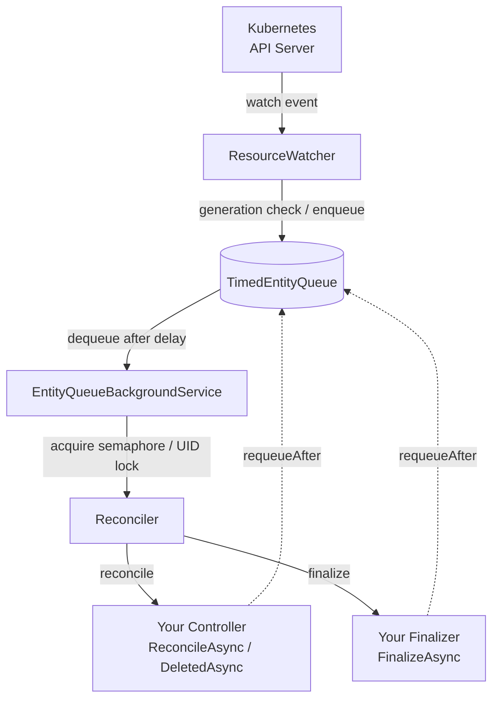

# Controllers

Controllers are the heart of your Kubernetes operator. They implement the reconciliation logic that ensures your custom resources are in the desired state.

## Creating a Controller

To create a controller, create a class that implements `IEntityController<TEntity>` where `TEntity` is your custom entity type:

```csharp
public class V1DemoEntityController(
    ILogger<V1DemoEntityController> logger,
    IKubernetesClient client) : IEntityController<V1DemoEntity>
{
    public async Task<ReconciliationResult<V1DemoEntity>> ReconcileAsync(
        V1DemoEntity entity,
        CancellationToken cancellationToken)
    {
        logger.LogInformation("Reconciling entity {Entity}.", entity);
        // Implement your reconciliation logic here
        return ReconciliationResult<V1DemoEntity>.Success(entity);
    }

    public async Task<ReconciliationResult<V1DemoEntity>> DeletedAsync(
        V1DemoEntity entity,
        CancellationToken cancellationToken)
    {
        logger.LogInformation("Deleting entity {Entity}.", entity);
        // Implement your cleanup logic here
        return ReconciliationResult<V1DemoEntity>.Success(entity);
    }
}
```

## Resource Watcher

When you create a controller, KubeOps automatically creates a resource watcher (informer) for your entity type. This watcher:

- Monitors the Kubernetes API for changes to your custom resources
- Triggers reconciliation when resources are added, modified, or deleted
- Maintains a local cache of resources to reduce API server load

## The Event Pipeline

When a watch event arrives from the Kubernetes API server, KubeOps routes it through a fixed pipeline before your controller code runs:



| Component | Responsibility |
|---|---|
| `ResourceWatcher` | Receives raw watch events, skips events without a generation change, enqueues the rest |
| `TimedEntityQueue` | Holds entries until their scheduled time; supports immediate and delayed dispatch |
| `EntityQueueBackgroundService` | Controls parallelism via a global semaphore and per-UID locks before handing off to the reconciler |
| `Reconciler` | Resolves the controller, manages finalizer attach/detach, calls either `ReconcileAsync`/`DeletedAsync` on the controller or `FinalizeAsync` on a registered finalizer |
| Your Controller | Implements the business logic for desired-state reconciliation |
| Your Finalizer | Runs cleanup logic before a resource is deleted; invoked instead of the controller when finalization is required |

The `requeueAfter` path (dashed) is triggered when your controller returns a `ReconciliationResult` with a non-zero `RequeueAfter` value.

KubeOps creates one such pipeline — watcher, queue, and background service — **per registered controller**. Multiple controllers for the same entity type (for example with different label selectors) therefore run fully independent pipelines that never suppress each other's events — see [Multiple Controllers per Entity](#multiple-controllers-per-entity). With the opt-in `WatchStrategy.SharedPerEntity`, a single shared watcher per entity type replaces the per-controller watchers and dispatches each event to all pipelines whose label selectors match — see [Watch Strategy](../configuration/watch-strategy) for the trade-offs.

## Reconciliation Loop

The reconciliation loop is the core of your operator's functionality. It consists of two main methods:

### ReconcileAsync

This method is called when:

- A new resource is created
- An existing resource is modified
- The operator starts up and discovers existing resources

```csharp
public async Task<ReconciliationResult<V1DemoEntity>> ReconcileAsync(
    V1DemoEntity entity,
    CancellationToken cancellationToken)
{
    // Check if required resources exist
    var deployment = await client.GetAsync<V1Deployment>(
        entity.Spec.DeploymentName,
        entity.Namespace(),
        cancellationToken);

    if (deployment == null)
    {
        // Create the deployment if it doesn't exist
        await client.CreateAsync(
            new V1Deployment
            {
                Metadata = new V1ObjectMeta
                {
                    Name = entity.Spec.DeploymentName,
                    NamespaceProperty = entity.Namespace()
                },
                Spec = new V1DeploymentSpec
                {
                    Replicas = entity.Spec.Replicas,
                    // ... other deployment configuration
                }
            },
            cancellationToken);
    }

    // Update status to reflect current state
    entity.Status.LastReconciled = DateTime.UtcNow;
    await client.UpdateStatusAsync(entity, cancellationToken);

    return ReconciliationResult<V1DemoEntity>.Success(entity);
}
```

### DeletedAsync

:::warning[Important]
The `DeletedAsync` method is informational only and executes asynchronously without guarantees. While it is called when a resource is deleted, it cannot ensure proper cleanup. For reliable resource cleanup, use [finalizers](./finalizer).
:::

This method is called when a resource is deleted, but should only be used for:

- Logging deletion events
- Triggering non-critical cleanup tasks
- Updating external systems about the deletion

```csharp
public async Task<ReconciliationResult<V1DemoEntity>> DeletedAsync(
    V1DemoEntity entity,
    CancellationToken cancellationToken)
{
    // Log the deletion event
    logger.LogInformation("Entity {Entity} was deleted.", entity);

    // Update external systems if needed
    await NotifyExternalSystem(entity, cancellationToken);

    return ReconciliationResult<V1DemoEntity>.Success(entity);
}
```

## Reconciliation Results

All reconciliation methods must return a `ReconciliationResult<TEntity>`. This provides a standardized way to communicate the outcome of reconciliation operations.

### Success Results

Return a success result when reconciliation completes without errors:

```csharp
public async Task<ReconciliationResult<V1DemoEntity>> ReconcileAsync(
    V1DemoEntity entity,
    CancellationToken cancellationToken)
{
    // Perform reconciliation
    await ApplyDesiredState(entity, cancellationToken);

    // Return success
    return ReconciliationResult<V1DemoEntity>.Success(entity);
}
```

### Failure Results

Return a failure result when reconciliation encounters an error:

```csharp
public async Task<ReconciliationResult<V1DemoEntity>> ReconcileAsync(
    V1DemoEntity entity,
    CancellationToken cancellationToken)
{
    try
    {
        await ApplyDesiredState(entity, cancellationToken);
        return ReconciliationResult<V1DemoEntity>.Success(entity);
    }
    catch (Exception ex)
    {
        logger.LogError(ex, "Failed to reconcile entity {Name}", entity.Name());
        return ReconciliationResult<V1DemoEntity>.Failure(
            entity,
            "Failed to apply desired state",
            ex);
    }
}
```

### Requeuing Entities

You can request automatic requeuing by specifying a `requeueAfter` parameter on the result:

```csharp
// Requeue after 5 minutes
return ReconciliationResult<V1DemoEntity>.Success(entity, TimeSpan.FromMinutes(5));
```

This is useful for:
- Polling external resources
- Implementing retry logic with backoff
- Periodic status checks
- Waiting for external dependencies

You can also enqueue an entity manually from within your controller using the `EntityQueue<TEntity>` delegate injected via DI. This allows you to schedule a reconciliation outside the normal return path:

```csharp
public class V1DemoEntityController(
    EntityQueue<V1DemoEntity> queue) : IEntityController<V1DemoEntity>
{
    public async Task<ReconciliationResult<V1DemoEntity>> ReconcileAsync(
        V1DemoEntity entity,
        CancellationToken cancellationToken)
    {
        // Schedule a follow-up reconciliation in 30 seconds without returning a result.
        // The delegate returns Task<bool>; await it (false means the enqueue was dropped).
        await queue(entity, ReconciliationType.Modified, ReconciliationTriggerSource.Operator,
            TimeSpan.FromSeconds(30), retryCount: 0, cancellationToken);

        return ReconciliationResult<V1DemoEntity>.Success(entity);
    }
    // ...
}
```

:::info[Durable Queue]
By default, queue entries are held in memory and lost on operator restart. To back the queue with an external system, see [Advanced Configuration — Queue Strategy](../configuration/queue-strategy).
:::

### Error Handling with Results

The `ReconciliationResult` provides structured error handling:

```csharp
public async Task<ReconciliationResult<V1DemoEntity>> ReconcileAsync(
    V1DemoEntity entity,
    CancellationToken cancellationToken)
{
    if (!await ValidateConfiguration(entity))
    {
        return ReconciliationResult<V1DemoEntity>.Failure(
            entity,
            "Configuration validation failed: Required field 'DeploymentName' is empty",
            requeueAfter: TimeSpan.FromMinutes(1));
    }

    try
    {
        await ReconcileInternal(entity, cancellationToken);
        return ReconciliationResult<V1DemoEntity>.Success(entity);
    }
    catch (KubernetesException ex) when (ex.Status.Code == 409)
    {
        // Conflict - retry after short delay
        return ReconciliationResult<V1DemoEntity>.Failure(
            entity,
            "Resource conflict detected",
            ex,
            requeueAfter: TimeSpan.FromSeconds(5));
    }
    catch (Exception ex)
    {
        logger.LogError(ex, "Unexpected error during reconciliation");
        return ReconciliationResult<V1DemoEntity>.Failure(
            entity,
            $"Reconciliation failed: {ex.Message}",
            ex,
            requeueAfter: TimeSpan.FromMinutes(5));
    }
}
```

## Important Considerations

### What Triggers Reconciliation

With the default settings, your controller only sees events for **spec changes** (and deletion
handling): status, label, and annotation updates are deduplicated away before they reach the
queue. This is intentional — write status from your controller without re-triggering yourself.
The exact rules and the `ByResourceVersion` alternative are described in
[Reconcile Strategy](../configuration/reconcile-strategy); the cache mechanics behind the
deduplication in [Caching](../configuration/caching).

### Parallel Reconciliation

`EntityQueueBackgroundService` enforces two levels of concurrency control before calling your controller:

1. A global `SemaphoreSlim` limits total concurrent reconciliations to `ParallelReconciliationSettings.MaxParallelReconciliations` (default: `Environment.ProcessorCount * 2`).
2. A per-UID `SemaphoreSlim` prevents two reconciliations for the same entity from running simultaneously.

When a second event for the same UID arrives while a reconciliation is in progress, the configured
`ConflictStrategy` applies (`WaitForCompletion` by default). See
[Advanced Configuration — Parallel Reconciliation](../configuration/parallel-reconciliation)
to change the defaults.

### RBAC Requirements

Controllers need appropriate RBAC permissions to function. Use the `[EntityRbac]` attribute to specify required permissions:

```csharp
[EntityRbac(typeof(V1DemoEntity), Verbs = RbacVerb.All)]
public class V1DemoEntityController(
    ILogger<V1DemoEntityController> logger,
    IKubernetesClient client) : IEntityController<V1DemoEntity>
{
    // Controller implementation
}
```

For more details about RBAC configuration, see the [RBAC documentation](../rbac).

## Best Practices

### Idempotency

- Make your reconciliation logic idempotent
- The same reconciliation should be safe to run multiple times
- Always check the current state before making changes

```csharp
public async Task<ReconciliationResult<V1DemoEntity>> ReconcileAsync(
    V1DemoEntity entity,
    CancellationToken cancellationToken)
{
    // Check if required resources exist
    if (await IsDesiredState(entity, cancellationToken))
    {
        return ReconciliationResult<V1DemoEntity>.Success(entity);
    }

    // Only make changes if needed
    await ApplyDesiredState(entity, cancellationToken);
    return ReconciliationResult<V1DemoEntity>.Success(entity);
}
```

### Error Handling

- Use `ReconciliationResult.Failure()` for errors
- Include meaningful error messages
- Use the `requeueAfter` parameter for retry logic
- Preserve exception information

```csharp
public async Task<ReconciliationResult<V1DemoEntity>> ReconcileAsync(
    V1DemoEntity entity,
    CancellationToken cancellationToken)
{
    try
    {
        await ReconcileInternal(entity, cancellationToken);
        return ReconciliationResult<V1DemoEntity>.Success(entity);
    }
    catch (Exception ex)
    {
        logger.LogError(ex, "Error reconciling entity {Name}", entity.Name());
        return ReconciliationResult<V1DemoEntity>.Failure(
            entity,
            $"Reconciliation failed: {ex.Message}",
            ex,
            requeueAfter: TimeSpan.FromMinutes(1));
    }
}
```

### Resource Management

- Clean up resources when entities are deleted
- Use finalizers to ensure proper cleanup
- Monitor resource usage and implement limits

### Performance

- Keep reconciliation logic efficient
- Avoid long-running operations in the reconciliation loop
- Use background tasks for time-consuming operations

## Filtering Watched Resources

By default, a controller's resource watcher observes all resources of the given entity type
cluster-wide. If `OperatorSettings.Namespace` is configured, the watcher is automatically
scoped to that namespace instead.
You can further restrict the watched set using **label selectors** and **field selectors**.

### Label Selectors

Implement `IEntityLabelSelector<TEntity>` to filter resources by label expressions.
See the [Kubernetes Label Selectors documentation](https://kubernetes.io/docs/concepts/overview/working-with-objects/labels/#label-selectors) for the full syntax reference.
Register it when adding the controller:

```csharp
public class MyDemoEntityLabelSelector : IEntityLabelSelector<V1DemoEntity>
{
    public ValueTask<string?> GetLabelSelectorAsync(CancellationToken cancellationToken) =>
        ValueTask.FromResult<string?>(new EqualsLabelSelector("app", "my-operator"));
}

// Registration
builder.Services.AddKubernetesOperator()
    .AddControllerWithLabelSelector<V1DemoEntityController, V1DemoEntity, MyDemoEntityLabelSelector>();
```

When no label selector is needed, the built-in `DefaultEntityLabelSelector<TEntity>` returns `null`
(no filtering).

### Field Selectors

Kubernetes field selectors filter by resource fields (e.g. `metadata.name`, `metadata.namespace`).
They support `=` / `==` (equality) and `!=` (inequality) operators, and only a small subset of
fields per resource type.
See the [Kubernetes Field Selectors documentation](https://kubernetes.io/docs/concepts/overview/working-with-objects/field-selectors/) for the full syntax reference.

Implement `IEntityFieldSelector<TEntity>` and register it when adding the controller:

```csharp
public class MyDemoEntityFieldSelector : IEntityFieldSelector<V1DemoEntity>
{
    public ValueTask<string?> GetFieldSelectorAsync(CancellationToken cancellationToken) =>
        ValueTask.FromResult<string?>(new EqualsFieldSelector("metadata.name", "my-demo-entity"));
}

// Registration
builder.Services.AddKubernetesOperator()
    .AddControllerWithFieldSelector<V1DemoEntityController, V1DemoEntity, MyDemoEntityFieldSelector>();
```

When no field selector is needed, the built-in `DefaultEntityFieldSelector<TEntity>` returns `null`
(no filtering).

### Summary of Registration Methods

| Method | Label Selector | Field Selector |
|---|---|---|
| `AddController<TImpl, TEntity>()` | Default (none) | Default (none) |
| `AddControllerWithLabelSelector<TImpl, TEntity, TLabel>()` | Custom | Default (none) |
| `AddControllerWithFieldSelector<TImpl, TEntity, TField>()` | Default (none) | Custom |

### Declaring Selectors with Attributes

Instead of calling the `AddControllerWith…Selector` methods manually, you can annotate the
controller class. The source generator picks the attribute up and emits the matching registration
into `RegisterControllers()` / `RegisterComponents()`:

```csharp
[LabelSelector(typeof(MyDemoEntityLabelSelector))]
public class V1DemoEntityController : IEntityController<V1DemoEntity>
{
    // ...
}

// or
[FieldSelector(typeof(MyDemoEntityFieldSelector))]
public class V1DemoEntityController : IEntityController<V1DemoEntity>
{
    // ...
}
```

A controller supports one selector kind at a time (label **or** field selector), matching the
builder methods. Declaring both `[LabelSelector]` and `[FieldSelector]` on the same controller is a
compile-time error (`KOG001`); split the work into two controllers instead.

## Multiple Controllers per Entity

The same entity type can be served by **multiple independent controllers**, each with its own label
or field selector. Every registration creates a fully separate watch → queue → reconcile pipeline,
so controllers with overlapping selectors both reconcile an entity that matches both:

```csharp
builder.Services.AddKubernetesOperator()
    .AddControllerWithLabelSelector<ManagedController, V1DemoEntity, ManagedLabelSelector>()
    .AddControllerWithLabelSelector<ConfigController, V1DemoEntity, ConfigLabelSelector>();
```

Notes:

- Each pipeline maintains its own watch connection, queue, and deduplication cache, so the
  controllers never suppress each other's events — even for the same object.
- Registering the exact same controller/selector combination twice throws at registration time
  (it would only open a redundant watch stream).
- The `EntityQueue<TEntity>` requeue delegate routes to the pipeline the current reconciliation
  originated from. Inject it into the controller (or another scoped service); with multiple
  controllers per entity it cannot be resolved from a singleton.
- N controllers means N watch connections per entity type by default. If that becomes a concern
  (many controllers, many objects, overlapping selectors), switch to the shared watch mode — see
  [Watch Strategy](../configuration/watch-strategy).

:::warning
Multiple controllers per entity are supported only on the **default in-memory queue** with
**non-custom leader election** (`LeaderElectionType.None` or `LeaderElectionType.Single`), where each
pipeline owns its queue and reconciler. Under
[`QueueStrategy.Custom`](../configuration/queue-strategy#custom) or
[`LeaderElectionType.Custom`](../configuration/leader-election) all pipelines share a single
user-owned queue and a single reconciler with no per-pipeline identity, so only **one controller per
entity** is allowed — registering a second one throws an `InvalidOperationException`.
:::

## Common Pitfalls

1. **Infinite Loops**: Avoid creating reconciliation loops that trigger themselves
2. **Missing Error Handling**: Always handle potential errors
3. **Resource Leaks**: Ensure proper cleanup of resources
4. **Missing RBAC Configuration**: Configure appropriate permissions
5. **Status Updates**: Remember that status updates don't trigger reconciliation